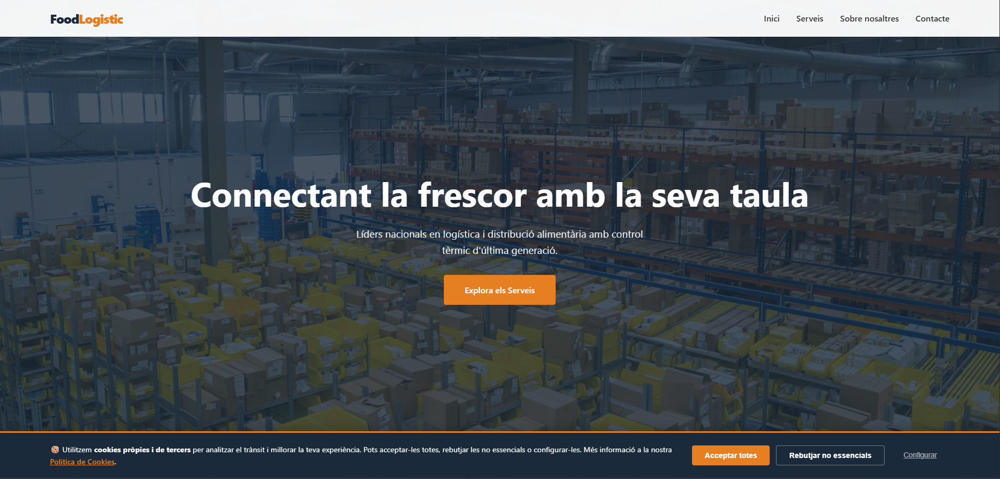
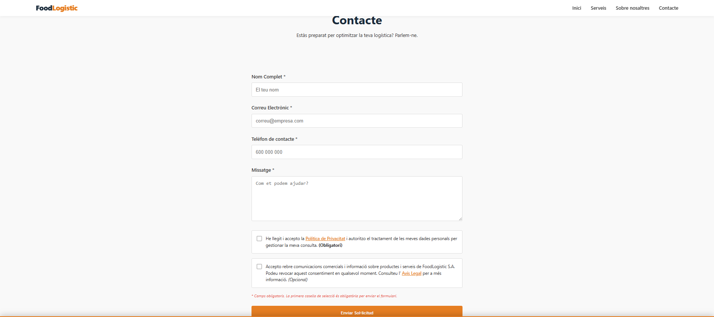
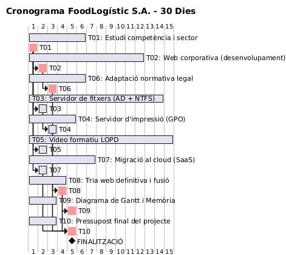

# **Proposta Tècnica i Comercial: Modernització Digital de FoodLogístic S.A.**

## **1\. Introducció**

**Descripció del client:** FoodLogístic S.A. és una empresa del sector logístic alimentari amb una plantilla de 35 treballadors. Actualment disposen d'una infraestructura de correu antiquada basada en un servei de hosting extern que presenta problemes de seguretat i limitacions de col·laboració.

**Objectius de la proposta:**

Modernitzar la infraestructura de comunicació i col·laboració mitjançant el núvol.  
Implementar una presència web professional, atractiva i 100% legal.  
Garantir la seguretat de la informació i el compliment normatiu (RGPD/LOPD).  
Optimitzar els costos operatius amb un model de subscripció escalable.

**Resum Executiu:** Aquesta proposta presenta una solució integral que combina la potència de Microsoft 365 per a la gestió interna i una pàgina web d'alt rendiment optimitzada per a la conversió i la sostenibilitat, tot sota un pressupost tancat i una execució en 4 setmanes.

---

## **2\. Anàlisi de Necessitats**

A partir de l'estudi de la infraestructura actual de FoodLogístic S.A. realitzat per Aleix Morillas i l’Arnau Domínguez, s'han detectat els següents punts crítics:

| Problema detectat | Impacte en el negoci | Solució proposada |
| :---- | :---- | :---- |
| **Correu hosting antiquat** | Pèrdua de correus, manca de sincronització, spam constant i vulnerabilitat a atacs de phishing. | Migració de bústies cap a **Microsoft 365 Exchange Online** amb 50 GB per usuari i bústies compartides. |
| **Web obsoleta i no legal** | Imatge corporativa degradada i risc de sancions per incompliment del RGPD/LSSI-CE. | Desenvolupament d'una nova **landing page en HTML5/CSS3** amb un banner de cookies interactiu i textos legals auditats. |
| **Falta d'eines de col·laboració** | Dificultat per treballar en equip, duplicitat de fitxers i gestió d'inventaris ineficient. | Implementació de **Microsoft Teams** i **OneDrive/SharePoint** (1 TB per usuari) per centralitzar els fitxers i la comunicació. |
| **Absència de suport tècnic** | Temps d'aturada elevats (downtime) davant de qualsevol incidència informàtica. | Inclusió d'un **servei de manteniment preventiu i correctiu** amb suport remot. |

---

## **3\. Proposta de Solució**

### **3.1 Infraestructura i Serveis al Núvol**

S'ha escollit **Microsoft 365 Business Standard** com a eix central per la seva robustesa i seguretat.

**Seguretat:** Activació de l'Autenticació Multifactor (MFA), polítiques contra el phishing mitjançant Microsoft Defender i xifratge de dades tant en trànsit com en repòs.  
**Eines:** Ús d'Excel d'escriptori per a la gestió d'inventaris complexos i Microsoft Teams com a hub de comunicació interna per als 35 treballadors.  
**Capacitat:** 50 GB de bústia de correu professional per usuari i 1 TB d'emmagatzematge al núvol (OneDrive/SharePoint).

### **3.2 Presència Web i Seguretat Digital**

**Tecnologia:** Disseny d'una landing page corporativa utilitzant **HTML5 semàntic** i **CSS3**, optimitzada per a motors de cerca (SEO), amb estats hover refinats i un disseny totalment adaptatiu (responsive).  
**Legalitat:** Desenvolupament d'un banner de cookies personalitzat mitjançant JavaScript per a la memòria de sessió, llistes de control de consentiment de l'usuari i modals informatius complets.  
**Sostenibilitat:** Ús de fonts del sistema i codi net per minimitzar el pes dels fitxers, reduint el temps de càrrega i la petjada de carboni del lloc web.

### **3.3 Seguretat i LOPD (Formació audiovisual)**

Com a part del desplegament de seguretat liderat per l’Arnau Domínguez i l’Aleix Morillas, s'inclouen píndoles formatives en format vídeo per garantir que el personal de FoodLogístic S.A. estigui capacitat:

**Vídeo 1: "Compliment legal en el dia a dia"** \-\> Bones pràctiques per a la gestió de dades de clients, ús correcte de les contrasenyes i prevenció d'atacs informàtics bàsics.  
**Vídeo 2: "Protecció de dades a RRHH i Gestió"** \-\> Protocol de tractament de dades confidencials, drets ARSLOPD i com actuar davant una possible bretxa de seguretat.

### **3.4 Presència web: Requisits detallats**

#### **1\. Descripció funcional**

Com a desenvolupadors d'aquest projecte web, la nostra missió ha estat transformar una simple landing page en una plataforma corporativa professional, segura i transparent. Ens hem centrat a equilibrar un disseny visual modern amb el compliment estricte de les normatives vigents. La nostra prioritat ha estat l'usuari: garantir que la seva navegació sigui fluida, que la informació de contacte (específicament la seu de Mataró) sigui accessible i, sobretot, que tingui el control total sobre les seves dades personals mitjançant un sistema de consentiments clar i robust.

#### **2\. Llista de requisits legals**

**A. Identificació i transparència:**  
  * **Avís Legal:** Pàgina/modal que identifica completament l'empresa (Nom social: FoodLogístic S.A., NIF, adreça física a Mataró i dades de contacte).  
  * **Finalitat del lloc web:** Explicació de la prestació de serveis de logística alimentària.  
**B. Protecció de dades:**  
  * **Política de Privacitat:** Informació detallada sobre el responsable del tractament, finalitat i temps de conservació de les dades.  
  * **Drets ARSLOPD:** Exercici dels drets d'Accés, Rectificació, Supressió, Limitació, Oposició i Portabilitat.  
  * **Base Legal:** Consentiment exprés de l'interessat com a base jurídica principal.  
**C. Gestió del consentiment:**  
  * **Banner de Cookies:** Bloqueig previ de cookies no essencials fins a l'acceptació o configuració de l'usuari.  
  * **Checkboxes de Consentiment en Formularis:**  
    * Checkbox 1 (Obligatori): Acceptació de la política de privacitat (desmarcat per defecte).  
    * Checkbox 2 (Opcional): Consentiment per a enviaments comercials o newsletter.  
  * **Enllaços Legals:** Accessibles directament des del formulari de contacte.  
**D. Seguretat tècnica:**  
  * **Mesures de Seguretat:** Certificat SSL/TLS activat per al trànsit web i emmagatzematge segur de dades enviades.

---

## **4\. Pressupost Econòmic**

El pressupost s'estructura en un model de subscripció anual més un servei de manteniment per evitar despeses inicials elevades.

### **Costos d'Implantació (Pagament Únic)**

Configuració de dominis, bústies de correu i disseny web: **0 €** (Incolòs en el servei de llançament).

### **Costos Recurrents (Anuals)**

| Concepte | Descripció | Preu Anual |
| :---- | :---- | :---- |
| **Microsoft 365 Business Standard** | 35 llicències (11,70 €/mes per usuari) | 4.914 € |
| **Hosting \+ Domini** | Servidor web segur i manteniment del domini | 132 € |
| **Manteniment Preventiu** | Suport tècnic, actualitzacions i seguretat | 1.800 € |
| **TOTAL ANUAL** |  | **6.846 € \+ IVA** |

---

## **5\. Planificació Temporal**

El projecte s'executarà durant un període de **4 setmanes (Abril \- Maig 2026\)** seguint la planificació dissenyada per l'Aleix Morillas i l’Arnau Domínguez:

\[Setmana 1\] ───\> Fase d'Anàlisi (T01): Consulta inicial i estudi de competència.  
\[Setmana 2\] ───\> Fase de Disseny (T02-T04): Maquetació web i configuració de servidors.  
\[Setmana 3\] ───\> Fase d'Implementació (T05-T07): Migració al núvol i formació LOPD.  
\[Setmana 4\] ───\> Fase de Tancament (T08-T10): Proves finals, entrega de l'informe i pressupost.

---

## **6\. Conclusions**

La proposta desenvolupada per a FoodLogístic S.A. no només resol els problemes tècnics actuals, sinó que dota l'empresa d'una infraestructura professional i escalable.

**Beneficis clau per al client:**

1. **Seguretat de nivell empresarial:** Implementació de protecció avançada contra phishing i ransomware amb Microsoft Defender i MFA, minimitzant els riscos de pèrdua de dades.  
2. **Eficiència i Col·laboració:** Centralització de la comunicació a través de Teams i accés a 1 TB d'emmagatzematge per usuari, permetent el treball fluid i en temps real per als 35 empleats.  
3. **Presència Web Professional i Legal:** Una web ràpida, sostenible i totalment adaptada a la normativa RGPD/LSSI-CE, evitant sancions i millorant la confiança dels clients.